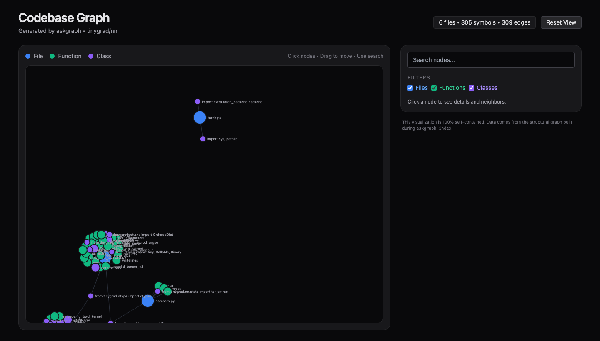
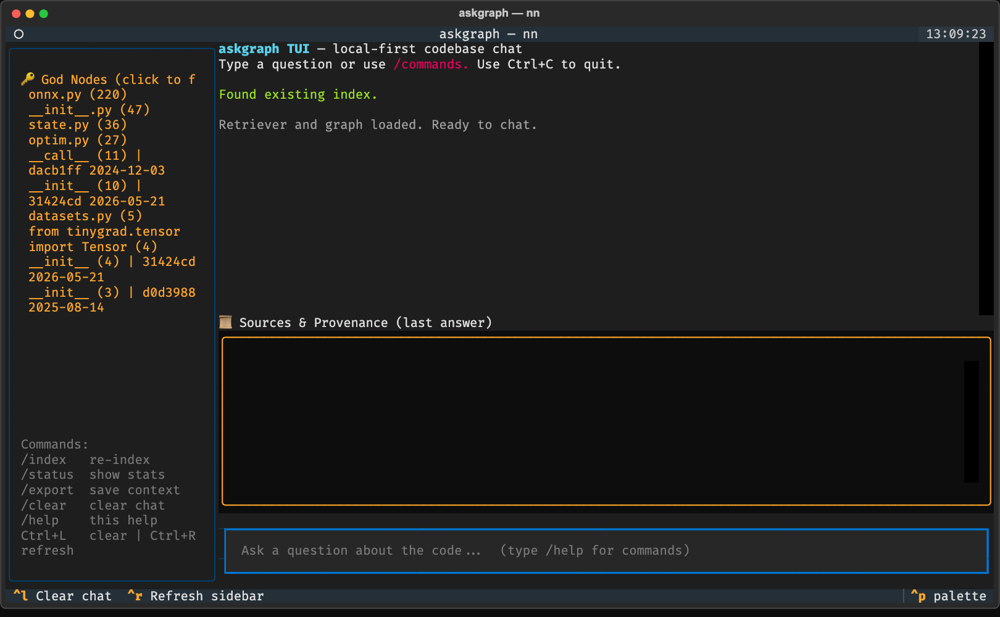
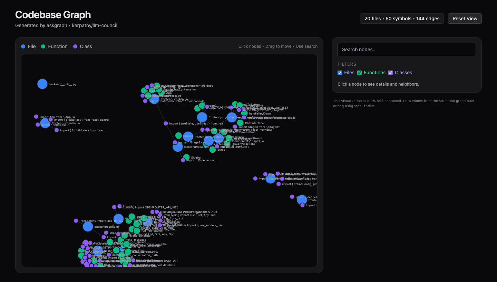

# askgraph

```
   ___        __                               __
  /   |  ____/ /______  _________ _____  _____/ /_
 / /| | / __  / ___/ _ \/ ___/ __ `/ __ \/ ___/ __ \
/ ___ |/ /_/ (__  )  __/ /  / /_/ / /_/ / /__/ / / /
\_/ |__/\__,_/____/\___/_/   \__, /\____/\___/_/ /_/
                            /____/
```

**Local-first, privacy-first codebase Q&A powered by a structural knowledge graph + semantic search + git provenance.**

Ask natural-language questions about any codebase. Everything runs on *your* machine — your code never leaves it. Agents get structured, low-token context with real architecture and history.

[](LICENSE)
[](https://www.python.org/downloads/)
[](https://github.com/bakhliustov/askgraph/actions/workflows/ci.yml)

> Inspired by [Graphify](https://graphify.net/) (pre-computed structural graphs, god nodes, self-contained reports) and [OpenGSD](https://opengsd.net/) (terminal-native, honest, git-aware workflows). `askgraph` is the standalone, aggressively local companion: a fast CLI/TUI + MCP server you can point at any folder.

---

## Why

AI coding agents write code fast. The bottleneck is now *understanding what was written and why*. The usual options are either too shallow (grep), too expensive/privacy-hostile (whole files into a giant cloud context), or locked to one IDE.

`askgraph` builds a persistent, local, **structural** memory of a codebase that you and your agents can query instantly and privately:

- **Local-only by default** — embeddings via [fastembed](https://github.com/qdrant/fastembed) (CPU), vectors in [Chroma](https://www.trychroma.com/), generation via [Ollama](https://ollama.com). No data leaves your machine.
- **Structure, not just similarity** — tree-sitter extracts functions/classes/imports/calls into a graph; retrieval fuses embeddings with identifier/symbol-name matching and expands hits with real neighbors.
- **Git-aware** — optional per-symbol blame answers "when and why was this introduced?"
- **Agent-native** — an MCP server exposes the same power to Claude Code, Cursor, Aider, etc.

## How it works

```
discover → chunk (tree-sitter) → embed (fastembed) → Chroma
                     │
                     └── structural graph.json (files, symbols, imports, calls, git blame)
                                  │
ask ── hybrid retrieve (semantic + lexical + graph neighbors) ── synthesize (Ollama) ── cited answer
```

The index lives in a `.askgraph/` directory inside the target repo (gitignored by default): the Chroma vector store, `graph.json`, `metadata.json`, and the generated `GRAPH_REPORT.md` + self-contained `graph.html`.

## Install

```bash
# from source (recommended while pre-release)
uv pip install -e '.[git,tui,mcp]'

# or pick extras à la carte
uv pip install -e .                 # core CLI
uv pip install -e '.[git]'          # + per-symbol git provenance (GitPython)
uv pip install -e '.[tui]'          # + Textual chat UI
uv pip install -e '.[mcp]'          # + MCP server for agents
uv pip install -e '.[tree-sitter-full]'  # + JS/TS/Go/Rust parsers
```

The first index downloads a small embedding model (`BAAI/bge-small-en-v1.5`, ~100 MB) to your local cache, then runs fully offline. For synthesized answers, install [Ollama](https://ollama.com) and pull a small model:

```bash
ollama pull llama3.2   # or qwen2.5:3b, gemma2:2b — small local models work great
```

## Quick start

```bash
askgraph index .                       # build the index + graph + report
askgraph ask "How does the Tensor autograd work?"
askgraph status .                      # graph stats + god nodes
askgraph report .                      # regenerate GRAPH_REPORT.md + graph.html
askgraph export "the lowering pipeline" -o context.md   # rich context pack for agents
askgraph tui .                         # interactive chat UI  (needs [tui])
askgraph mcp .                         # run as an MCP server (needs [mcp])
```

Retrieval works without Ollama (`--raw` shows the hybrid chunks). With Ollama running you get a synthesized, **cited** answer. Per-symbol git provenance is opt-in (it runs `git blame` per file):

```bash
ASKGRAPH_USE_GIT_BLAME=true askgraph index .
```

## Real example: tinygrad

Indexing tinygrad's `nn/` package (the neural-network layers) with provenance enabled:

```
$ ASKGRAPH_USE_GIT_BLAME=true askgraph index .
✓ Indexed 6 files, added 645 chunks.
   Structural graph: 311 nodes, 309 edges  →  graph.json
✓ Report artifacts generated: GRAPH_REPORT.md + graph.html
```

That's a **311-node graph** — 6 files plus 305 symbols (276 functions, 29 classes) wired by contains / imports / calls edges, all built locally. The auto-generated `graph.html` is a self-contained, interactive view:



Each symbol also carries real git history (with `ASKGRAPH_USE_GIT_BLAME=true`), e.g.:

```
nn/__init__.py :: class Linear
  [git provenance] last touched in 31424cda by chenyu on 2026-05-21
  — Tensor.requires_grad -> is_param (#16325)  (+4 prior changes)
```

The TUI (`askgraph tui .`) puts the same data in a chat interface — a god-node sidebar with per-symbol commit info, a provenance panel, and synthesized answers:



> **Performance note.** Embedding runs on CPU (~hundreds of chunks/min depending on chunk length), so the *first* index of a large repo takes a few minutes; queries afterward are instant. `askgraph` skips machine-generated/vendored blobs by default — `autogen/`, `generated/`, and files larger than `ASKGRAPH_MAX_FILE_BYTES` (256 KB) — which keeps tinygrad's giant `runtime/autogen/` ctypes bindings out of the index. Tune the scope by pointing `askgraph` at a subpackage (`askgraph index path/to/pkg`).

### Also tried on (multi-language)

`askgraph` builds **one** graph across languages in a repo. On [`karpathy/llm-council`](https://github.com/karpathy/llm-council) — a Python backend + React (JSX) frontend — a single index spans 7 Python, 7 JSX, and 3 JS files: **70 nodes, 50 symbols** (Python functions/classes alongside React components and arrow-function handlers), **100% with git provenance**.



[`karpathy/autoresearch`](https://github.com/karpathy/autoresearch) (Python) indexes to 54 nodes / 50 symbols in seconds. JS/TS parsing needs the `tree-sitter-full` extra.

## Evaluation (measured, not asserted)

Retrieval quality is measured, not hand-waved. Label cases as `question → [file or file::Symbol]` and run:

```bash
askgraph eval . --cases evals/llm-council.yaml -k 8
```

It reports **recall@k / MRR / hit-rate** and isolates each signal (vector → +lexical → +graph) so you can see what actually helps on *your* repo. Sample case sets live in [`evals/`](evals/).

Findings from the bundled suite (tinygrad/nn, autoresearch, llm-council, ~24 cases) drove real decisions:
- **Hybrid lexical fusion** (identifier/symbol-name matching) lifts mean **MRR 0.675 → 0.701** with **no recall regression** — but only at a *gentle* weight (`ASKGRAPH_LEXICAL_ALPHA=0.2`); heavier weights and naive rank-fusion *hurt* retrieval, which the harness caught before they shipped.
- Vector recall is already strong (1.0 on two of three repos); remaining misses are chunking-bound, not similarity-bound.

This eval-first loop is the project's compass for retrieval work — see [CHANGELOG.md](CHANGELOG.md) for the running results.

## Use with AI agents (MCP)

```bash
uv pip install -e '.[mcp]'
askgraph mcp .
```

The server exposes these tools to any MCP host (Claude Code, Cursor, Aider, …):

| Tool | What it returns |
|------|-----------------|
| `index_codebase` | Build/refresh the index + graph |
| `ask` | Hybrid-retrieved, synthesized, cited answer (+ provenance) |
| `get_god_nodes` | Most-connected symbols/files (architecture hotspots) |
| `get_communities` | Modularity-based module clusters |
| `compute_blast_radius` | Impact analysis — nodes within N hops of a symbol/file |
| `export_agent_context` | Rich JSON pack: chunks + subgraph + provenance + token estimate |

The point: agents get low-token, high-signal, *structured* context (graph neighbors + history) instead of whole files dumped into the window — and nothing is exfiltrated.

## Configuration

All settings are overridable via `ASKGRAPH_*` env vars (or a `.env` file). The most useful:

| Variable | Default | Purpose |
|----------|---------|---------|
| `ASKGRAPH_EMBEDDING_MODEL` | `BAAI/bge-small-en-v1.5` | fastembed model (must match between index & query) |
| `ASKGRAPH_DEFAULT_LLM_MODEL` | `llama3.2` | Ollama model for synthesis |
| `ASKGRAPH_USE_GIT_BLAME` | `false` | Per-symbol git provenance (slower; runs `git blame` per file) |
| `ASKGRAPH_MAX_FILE_BYTES` | `262144` | Skip files larger than this (0 = no limit) |
| `ASKGRAPH_TOP_K` | `8` | Chunks retrieved per query |
| `ASKGRAPH_LOCAL_ONLY` | `true` | Refuse remote providers |

## Privacy

- The index lives inside the target's `.askgraph/` (or a path you control) and is gitignored by default.
- Embeddings and generation default to local runtimes (fastembed + Ollama).
- `local_only=True` refuses remote providers unless you deliberately override it.
- Delete the index directory any time — your source is untouched.

## Project structure

```
src/askgraph/
├── cli/          # Typer CLI (index, ask, status, report, export, eval, tui, mcp)
├── indexing/     # discovery + tree-sitter parsing + chunking + git blame + Chroma
├── query/        # hybrid retriever + graph expansion + Ollama synthesizer
├── report/       # GRAPH_REPORT.md + self-contained graph.html generator
├── tui/          # Textual chat UI
├── mcp_server.py # MCP server for agents
└── config.py
```

## Development

```bash
uv sync --group dev
uv run ruff check . && uv run ruff format --check .
uv run mypy src
uv run pytest -q
```

CI runs lint, format, type-check, and tests on Python 3.11 and 3.12.

## Roadmap

- Deeper relationships (call graphs, type edges) beyond contains/imports
- More first-class languages via the `tree-sitter-full` extra
- Published benchmarks across several public repos
- Editor extension

## Contributing

Issues and PRs welcome — especially more languages, richer graph algorithms, and retrieval-quality improvements. Please run `ruff`, `mypy`, and `pytest` before submitting.

## License

[MIT](LICENSE) — use it, fork it, ship with it.

---

**askgraph** — understand your code. Locally. Fast. With structure.
